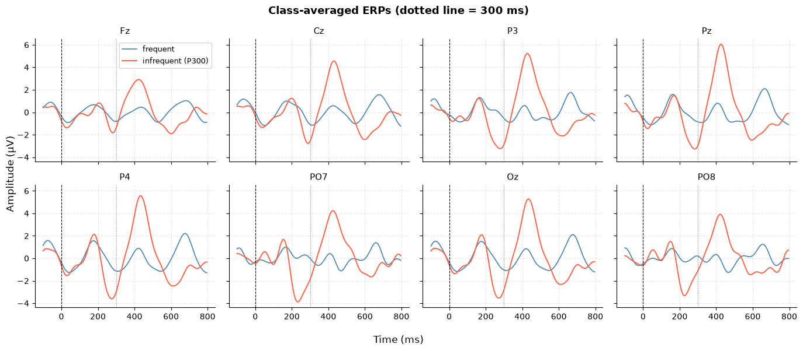
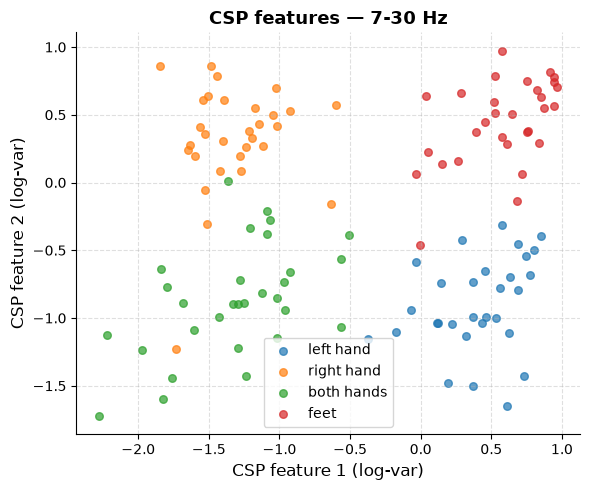
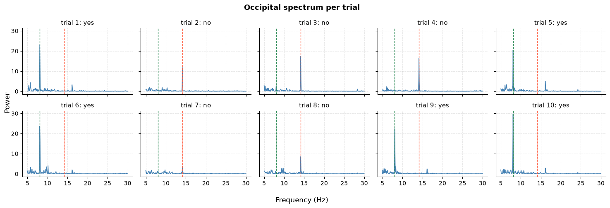

# Brain-Machine Interfacing

Coursework for the Brain-Machine Interfacing course (Uni Ulm, Master KI). Jupyter notebooks that analyze real EEG recordings — from raw signals to working classifiers for three classic BCI paradigms.

| P300 speller | Motor imagery | SSVEP |
|---|---|---|
|  |  |  |

## What's inside

- **`exercise_1/`** — EEG basics: ongoing EEG and evoked responses
- **`exercise_2/`** — P300 speller, with stepwise regression for channel/feature selection
- **`exercise_3/`** — motor imagery: spectrograms, ERD/ERS, periodogram features, LDA, CSP
- **`final_project/`** — end-to-end pipelines for P300, motor imagery, and SSVEP on separate datasets

## Getting started

Environment is managed with [pixi](https://pixi.sh):

```sh
pixi install
pixi run jupyter lab
```
